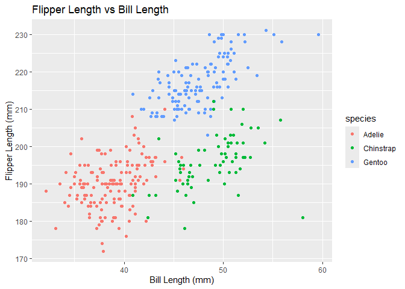

P8105_HW1_yj2802
================
Yizhen Jia
2024-09-21

# Poblem 1

``` r
data("penguins", package = "palmerpenguins")
```

Introduction: The penguins dataset has 344 rows and 8 columns. Including
variables of species, island, bill_length_mm, bill_depth_mm,
flipper_length_mm, body_mass_g, sex, year. It contains data from 2007 to
2009 of 3 species of penguins that are Adelie, Gentoo, and Chinstrap.
The mean flipper length of the penguins is 200.9152047.

Below is the scatterplot of flipper_length_mm (y) vs bill_length_mm (x):

``` r
library(tidyverse)
```

    ## ── Attaching core tidyverse packages ──────────────────────── tidyverse 2.0.0 ──
    ## ✔ dplyr     1.1.4     ✔ readr     2.1.5
    ## ✔ forcats   1.0.0     ✔ stringr   1.5.1
    ## ✔ ggplot2   3.5.1     ✔ tibble    3.2.1
    ## ✔ lubridate 1.9.3     ✔ tidyr     1.3.1
    ## ✔ purrr     1.0.2     
    ## ── Conflicts ────────────────────────────────────────── tidyverse_conflicts() ──
    ## ✖ dplyr::filter() masks stats::filter()
    ## ✖ dplyr::lag()    masks stats::lag()
    ## ℹ Use the conflicted package (<http://conflicted.r-lib.org/>) to force all conflicts to become errors

``` r
ggplot(penguins, aes(x = bill_length_mm, y = flipper_length_mm, color = species)) +geom_point() +labs(title = "Flipper Length vs Bill Length", x = "Bill Length (mm)", y = "Flipper Length (mm)")
```

    ## Warning: Removed 2 rows containing missing values or values outside the scale range
    ## (`geom_point()`).

<!-- -->

# Problem 2

Firstly, create 4 different variables:

``` r
# set seed to ensure reproducibility
set.seed(1234)
# Create the data
numeric_var = rnorm(10)
logical_var = numeric_var > 0
character_var = letters[1:10]
factor_var = factor(rep(c("Level1", "Level2", "Level3"), length.out = 10))
# Combine into a dataframe
df = data.frame(numeric_var, logical_var, character_var, factor_var)
# Pull the variables column out of the dataframe
library(tidyverse)
numeric_vector = df %>% pull(numeric_var)
logical_vector = df %>% pull(logical_var)
character_vector = df %>% pull(character_var)
factor_vector = df %>% pull(factor_var)
```

1)  For a random sample of size 10 from a standard Normal distribution:
    Mean=-0.3831574

2)  For a logical vector indicating whether elements of the sample are
    greater than 0: Mean=0.4

3)  For a character vector of length 10: Mean=NA

4)  For a factor vector of length 10, with 3 different factor “levels”:
    Mean=NA

Result: the random sample and the logical vector works, while the
character vector and the factor vector does not work.

When Convert the logical, character, and factor variables to numeric by
the following code:

``` r
numeric_logical <- as.numeric(df$logical_var)
numeric_character <- as.numeric(df$character_var)
```

    ## Warning: NAs introduced by coercion

``` r
numeric_factor <- as.numeric(df$factor_var)
```

1)  For a logical vector indicating whether elements of the sample are
    greater than 0: Mean=0.4. –\> This works because TRUE and FALSE are
    treated as 1 and 0, respectively.

2)  For a character vector of length 10: Mean=NA. –\> This gives an
    error because characters can’t be coerced into numbers.

3)  For a factor vector of length 10, with 3 different factor “levels”:
    Mean=1.9. –\> This works, but factors are converted to their
    underlying integer codes (e.g., Level1 –\> 1, Level2 –\> 2, etc.),
    so taking the mean might not make sense in this context.
